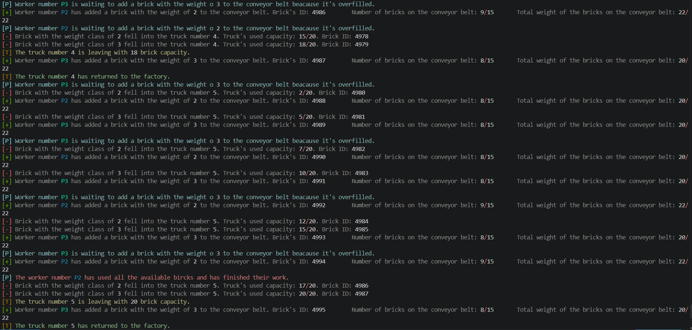
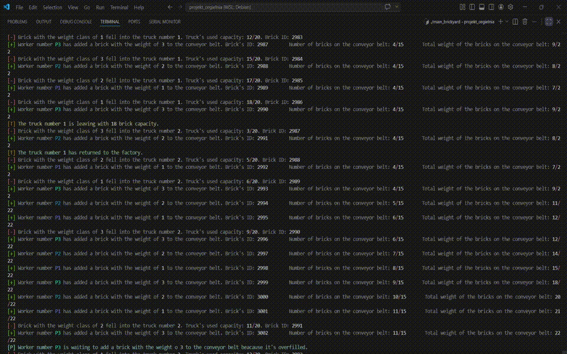

# Project Brickyard

This project's aim is to perfectly synchronize seperate processes and threads with semaphores and other inter-process communication methods. It simulates the way a simplified "brickyard" would operate.

The project was developed as a final project for Cracow University of Technology's Operating Systems course.

*Example of operation*

## Showcase

This video demonstrates how the program operates (it has been slowed down to 0.1× speed).

## Project structure

The main process (main_brickyard) initializes shared resources and creates:

- Workers – processes, which produce bricks of different weights (1, 2 or 3) and place them on the conveyor. If they use up all the bricks on their disposal (configurable in the files), they end their work.
- Conveyor – a process that transports bricks to a truck. It has a limited weight capacity, the workers can't place a brick on it, if it would cause exceeding this limit.
- Trucks – processes, which transport the bricks. There is always one truck under the conveyor belt and it collects the bricks from it. After the dispatcher tells the truck to go, it transports the bricks to another place and becomes unavailable for some time. The time, the capacity and the number of trucks are all configurable in the files. 
- Dispatcher – a process that monitors the system and manages truck departures. When it sees that the next brick that would fall into the truck standing under the conveyor belt, would make it exceed its brick capacity, it tells the truck to leave and immediately tells another truck to stand under the conveyor belt. If there are no trucks left, beacause all are in transport, he tells the conveyor belt to stop. He also ends the whole production, after all bricks are dealt with.

The project will never get stuck on any problem, no matter how the configurable values are set.

## Features
- Multi-process architecture (fork, exec)
- Inter-process communication using:
    - Shared memory (System V)
    - Semaphores
    - Message queues
    - Signals
- Synchronization between workers, conveyor, dispatcher, and trucks
- Simulation of production flow and resource constraints

## How to run

make
./main_brickyard